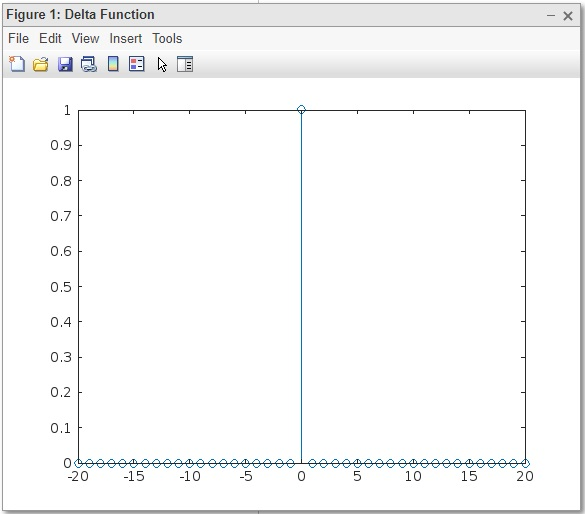

The delta function is a generalized function that can be defined as the limit of a class of delta sequences. The delta function is sometimes called "Dirac's delta function" or the "impulse symbol" (Bracewell 1999).

This <b>MATLAB SCRIPT</b> is used for <b>Plotting Delta Function</b>

### Result Screenshot

